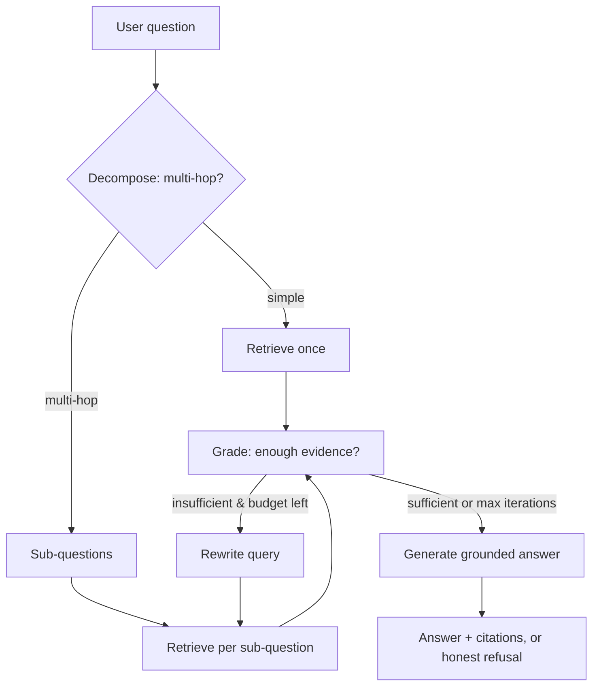

# Agentic RAG — Multi-Hop Question Answering with Retrieval Benchmarking

An end-to-end **Agentic Retrieval-Augmented Generation** system that answers open-domain
and multi-hop questions, then *measures* its own retrieval and generation quality against
standard benchmarks.

This is not a "wrap an LLM and call it RAG" demo. It builds the full pipeline — keyword
baseline → dense retrieval → reranking → a self-correcting agentic loop — and, crucially,
evaluates every stage so the design choices are backed by numbers rather than intuition.

---

## Why this project exists

Most RAG demos stop at "it returns an answer." This one is built to answer the harder
question an interviewer actually asks: **how do you know it's good, and where does the
extra machinery actually help?**

So every retrieval stage is benchmarked, the agent can decompose hard questions and retrieve
iteratively, and — most importantly — the final analysis is honest about *where the agentic
layer adds value and where it doesn't*.

---

## Architecture



### Retrieval stack (each layer is swappable and benchmarked)

| Layer | What it does | Implementation |
|-------|--------------|----------------|
| Sparse | Keyword baseline | BM25 (`rank_bm25`) |
| Dense | Semantic retrieval | bge-small-en-v1.5 + exact cosine |
| Hybrid | Combine sparse + dense | Reciprocal Rank Fusion |
| Rerank | Reorder top-k | Cross-encoder (ms-marco-MiniLM) |
| Agent | Multi-hop orchestration | LangGraph state machine |

---

## Datasets

| Dataset | Role | Why |
|---------|------|-----|
| **Natural Questions** | Primary QA (single-hop) | Real Google queries, natural full-sentence questions |
| **HotpotQA** | Multi-hop evaluation | Forces retrieval and reasoning across two documents |

Datasets are loaded in **BEIR format** (corpus / queries / qrels), which ships passages with
relevance judgments — so gold relevant passage ids come for free, no manual labeling.

**Methodology note — working set.** The full corpora are large (NQ 2.68M passages, HotpotQA
5.2M). For feasible indexing on free infrastructure, evaluation runs on a per-dataset
**working set**: every gold passage for the sampled queries is kept, plus ~5K random
distractors. Naive subsampling would silently drop gold passages and zero out retrieval
scores, so the sampler preserves gold by construction. Absolute scores are therefore
**optimistic** versus the full corpus — the value is in **relative comparison across
strategies**, run on identical data. The HotpotQA working set averages **exactly 2.0 gold
passages per query**, confirming every question genuinely requires combining two documents
(vs ~1.0 for single-hop NQ).

---

## Results

### Retrieval pipeline (NQ working set, 200 queries)

Each row adds one pipeline stage; the point is the *delta* each stage contributes.

| Configuration | Recall@10 | MRR@10 | NDCG@10 |
|---------------|-----------|--------|---------|
| BM25 (sparse baseline) | 0.867 | 0.782 | 0.786 |
| Dense (bge-small-en-v1.5) | 0.949 | 0.889 | 0.895 |
| Hybrid (RRF fusion) | 0.969 | 0.901 | 0.907 |
| **Hybrid + cross-encoder rerank** | **0.978** | **0.965** | **0.959** |

- **BM25 underperforms on NQ** — natural-language questions reward semantic matching over
  keyword overlap. Still, it finds gold for 87% of queries on its own.
- **Hybrid recovers ~40% of dense's remaining error** (Recall 0.949 → 0.969). BM25 and dense
  make *different* mistakes; RRF fuses their ranks (not raw scores — sidestepping incompatible
  score scales) to combine complementary signal.
- **Reranking is the largest jump in ranking quality** (MRR 0.901 → 0.965). The cross-encoder
  scores query–passage pairs jointly, pushing the gold passage to rank ~1 almost every time.

### Agentic layer — what it improves, and what it doesn't

The LangGraph agent (decompose → retrieve → grade → rewrite-loop → generate) was validated on
both corpora. The honest finding matters more than a flattering one:

**Where the agent clearly helps:**
- **Grounded honesty.** When the corpus lacks the facts, the agent returns *"I cannot answer
  this from the provided sources"* instead of hallucinating — even for questions whose answer
  it plausibly knows from pretraining (e.g. Google's founders). Demonstrated live. A plain
  single-shot generator gives no such guarantee.
- **Answer synthesis across documents.** On HotpotQA it correctly chained questions, e.g.
  *"In what year was the university where Sergei Tokarev was a professor founded?"* →
  *"Moscow State University was founded in 1755 [4]"*, combining two passages into one answer.
- **Self-correction.** On insufficient evidence the grader triggers a rewrite→retrieve loop,
  bounded by `max_iterations`. Verified end-to-end.

**Where the agent does *not* move the needle (and why):**
- **Retrieval recall on multi-hop questions.** On the small HotpotQA working set, a strong
  hybrid+rerank retriever already surfaces *both* gold passages in a single pass (single-shot
  and agentic both hit full-recall on the pilot sample). When a question is short and its two
  evidence passages are semantically close, decomposition adds LLM cost without improving recall.
- **Takeaway:** the agent's value is concentrated in *grounding, honesty, and answer synthesis*,
  not in raw retrieval recall — at least at this corpus scale. This shaped the zero-cost
  `_looks_simple` heuristic that skips decomposition on obviously-simple questions to conserve
  quota.

> This "where it helps / where it doesn't" framing is deliberate. "Agentic always wins" is a
> weaker, less credible claim than a measured account of the trade-offs.

---

## Key engineering decisions

A few choices made deliberately, each defensible in a design discussion:

- **Data-driven chunking.** Inspected passage lengths before chunking: only 1.4% of NQ
  passages exceed 256 words, so chunking is a near-no-op here. Blindly splitting everything
  would add cost and *hurt* embedding quality on already-short passages.
- **Exact search over a vector DB.** At ~5K vectors, brute-force cosine (`embeddings @ q`) is
  instant and exact. A vector DB (Chroma/FAISS) earns its keep at millions of vectors; the code
  keeps it swappable but doesn't pay for complexity it doesn't need.
- **RRF over score-weighted fusion.** Dense (0–1 cosine) and BM25 (unbounded) scores live on
  incompatible scales. Reciprocal Rank Fusion combines *ranks*, sidestepping normalization.
- **Gold-preserving corpus sampling.** Subsampling a 2.68M corpus naively drops the gold
  passages the queries need. The sampler keeps all gold, then adds distractors.
- **Prompt iteration over architecture.** Over-decomposition and an over-strict grader were both
  fixed by reframing prompts (rules + few-shot), not by adding components — the cheapest fix first.
- **Graceful degradation.** `safe_invoke` retries on rate-limit (429) errors so a single quota
  hiccup doesn't kill a long run — relevant for free-tier LLMs.
- **Provider-agnostic LLM.** Swapping Gemini ↔ OpenAI ↔ Anthropic is a one-line `.env` change;
  the agent code is untouched.

---

## Tech stack

- **Python 3.11**
- **LangChain + LangGraph** — agent orchestration and the self-correcting state machine
- **sentence-transformers** — embeddings (bge-small-en-v1.5) + cross-encoder reranking
- **rank_bm25** — sparse baseline
- **Gemini (free tier) by default** — provider-agnostic via `langchain-google-genai`; OpenAI /
  Anthropic swappable through `.env`
- **Streamlit** — interactive demo (planned)

---

## Project structure

```
agentic-rag/
├── config/config.yaml         # All tunable parameters in one place
├── src/
│   ├── data/                  # BEIR loaders + gold-preserving working set
│   ├── indexing/              # Chunking, BM25, vector index
│   ├── retrieval/             # BM25 / dense / hybrid (RRF) / reranker
│   ├── agent/                 # LangGraph: state, nodes, graph, prompts
│   ├── generation/            # Grounded answer generation
│   ├── evaluation/            # Recall@k / MRR / NDCG + RAGAS hooks
│   ├── llm.py                 # Provider-agnostic factory + safe_invoke
│   └── pipeline.py            # Wires everything together
├── scripts/                   # CLI: build index, run query, evaluate
├── app/streamlit_app.py       # Demo UI (planned)
├── notebooks/                 # EDA + experiments
└── tests/                     # Metric + fusion unit tests
```

---

## Quickstart

```bash
python -m venv .venv && source .venv/bin/activate
pip install -r requirements.txt
cp .env.example .env          # add a Gemini key (free, no card: aistudio.google.com)

python scripts/build_index.py --dataset natural_questions --sample 5000
python scripts/run_query.py --question "..."
python scripts/evaluate.py --dataset hotpot_qa --n 100
```

---

## Roadmap

- [x] **Phase 1 — Data & indexing.** NQ (BEIR), gold-preserving 5K working set, data-driven chunking.
- [x] **Phase 2 — Basic RAG.** Dense retrieval + exact cosine. Baseline Recall@10 0.949.
- [x] **Phase 3 — Hybrid + rerank.** RRF fusion + cross-encoder. MRR 0.889 → 0.965.
- [x] **Phase 4 — Agentic layer.** LangGraph: decomposition, answerability grading, self-correcting
  rewrite→retrieve loop, grounded generation (no hallucination), rate-limit-resilient.
- [x] **Phase 5 — Multi-hop.** HotpotQA (avg 2 gold/query); agent validated on chained questions.
- [x] **Phase 6 — Analysis.** Agentic vs single-shot retrieval compared; honest finding on where the
  agent helps (grounding, synthesis) vs where it doesn't (recall, at this scale).
- [ ] **Phase 7 — Demo.** Streamlit app exposing the agent's reasoning trace.

---

## License

MIT
